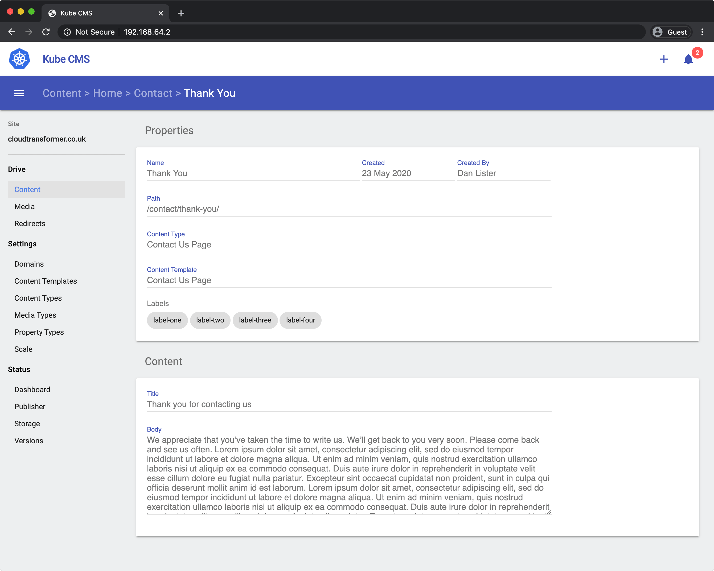

## Kube CMS

Kube CMS is a Content Management System that is designed to run within a multi-node Kubernetes cluster. Kube CMS works with Kuberenetes, Minikube and K3s. It provides a de-coupled backoffice editor and an internal image registry where versions of your websites are published too. Using the internal image registry allows Kube CMS to host your website and provide instant roll-backs, scaling and high availability.



## Installation

The `install.sh` script is a quick way to install Kube CMS onto your cluster. Using your current context, the script will create a new namespace and all the resources type it requires:

```bash
curl -sfL http://get.kubecms.com | sh -
```

To verify what namespace, services, deployments, pods, replica sets and ingress resources the install script creates, use the following command:

```bash
kubectl get all,ingress,persistentvolumeclaim --namespace kubecms
```

## Status

[](https://opensource.org/licenses/Apache-2.0)
[](https://github.com/kubecms/kubecms/actions?query=workflow%3Abackoffice)
[](https://github.com/kubecms/kubecms/actions?query=workflow%3Apublisher)
[](https://github.com/kubecms/kubecms/actions?query=workflow%queue)
[](https://github.com/kubecms/kubecms/actions?query=workflow%3Aregistry)
