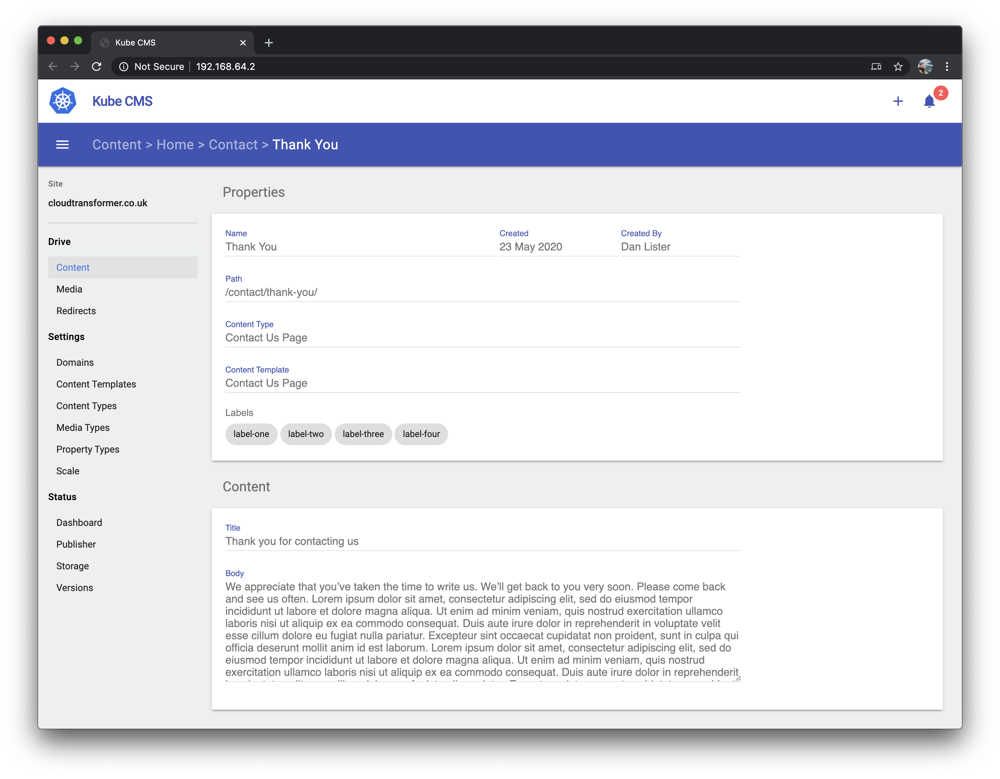

# Kube CMS

Kube CMS is a Content Management System that is designed to run within a multi-node Kubernetes cluster.



# Installation

```bash
curl -sfL http://get.kubecms.com | sh -
```

# Status


